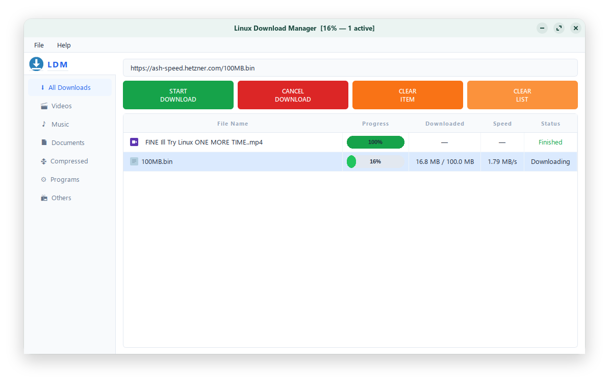
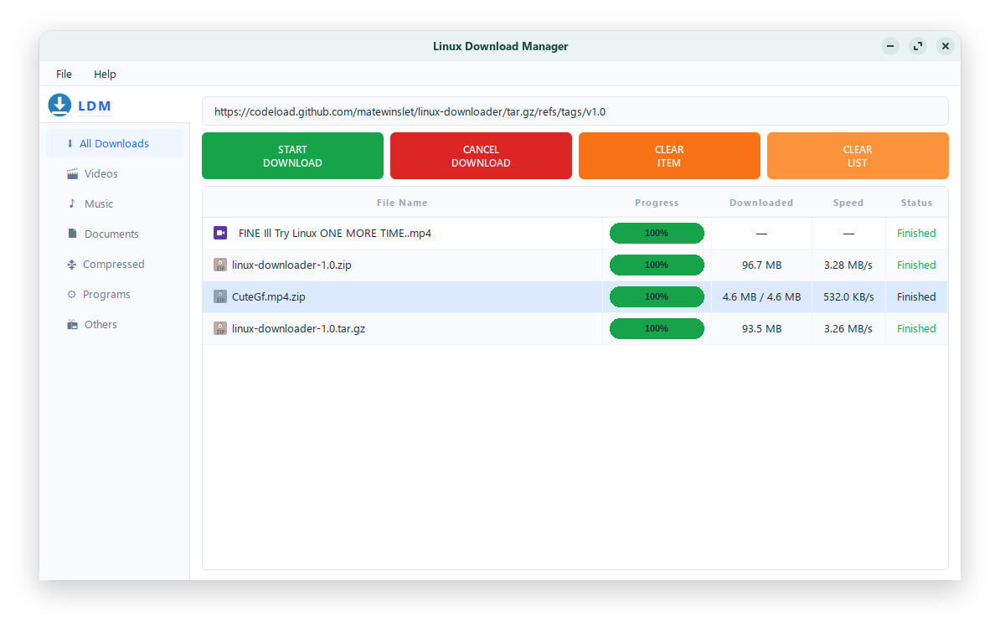
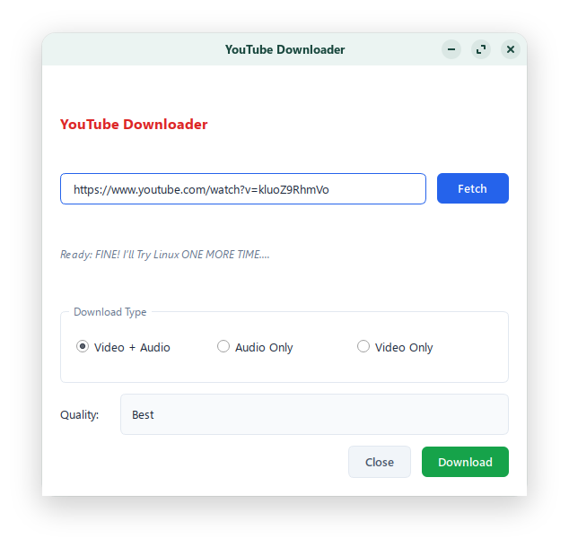
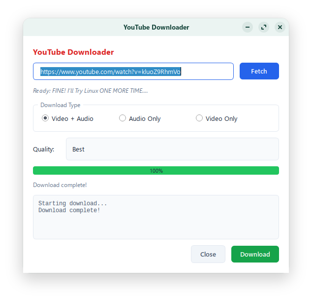
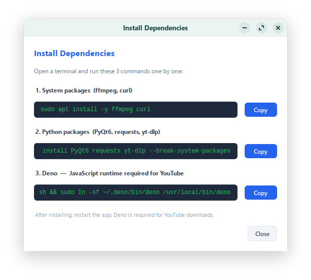
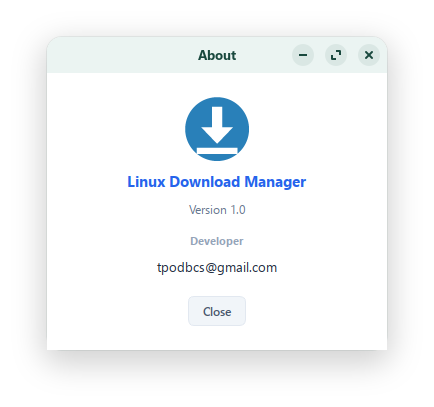
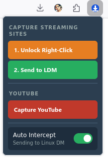

# Linux Download Manager (LDM)

A powerful, IDM-style download manager for Linux — with a Firefox extension, YouTube downloader, automatic file categorization, and video capture from streaming sites.


---

## Screenshots















---

## Features

- **Silent download interception** — Firefox downloads are automatically redirected to LDM with no "Cancelled" flash
- **YouTube Downloader** — download YouTube videos in any quality (Best, 1080p, 720p, 480p, 360p) or audio only (mp3, m4a, flac, wav, ogg, aac)
- **Video capture** — unlock right-click protection on streaming sites and capture video URLs directly
- **Auto file categorization** — files are automatically sorted into Videos, Music, Documents, Compressed, Programs, Others
- **Real-time progress** — progress bar, download speed, and file size displayed for every download
- **Already downloaded detection** — warns you if you try to download the same file again
- **Right-click context menu** — send any link directly to LDM from Firefox
- **Toggle interception** — disable automatic interception anytime from the extension popup
- **Clean light theme** — IDM-inspired interface with category sidebar

---

## Requirements

- Linux (Ubuntu/Debian based, tested on Zorin OS)
- Python 3.10+
- Firefox browser

---

## Installation

### 1. Clone the repository

```bash
git clone https://github.com/matewinslet/linux-downloader.git
cd linux-downloader
```

### 2. Run the installer

```bash
chmod +x install.sh
./install.sh
```

The installer will automatically:
- Install system packages (ffmpeg, curl)
- Install Python packages (PyQt6, requests, yt-dlp, browser-cookie3)
- Install Deno (JavaScript runtime required for YouTube)
- Generate and install app icons
- Create the desktop entry for your application menu

### 3. Install the Firefox Extension

Install the extension from the Firefox Add-ons store:

👉 **[Linux Download Manager on Firefox Add-ons](https://addons.mozilla.org/en-US/firefox/addon/linux-download-manager/)**

Or install manually by downloading the `.xpi` file from the [Releases](https://github.com/matewinslet/linux-downloader/releases) page and dragging it into Firefox.

---

## Usage

### Basic Downloads
1. Launch **Linux Download Manager** from your application menu
2. Install the Firefox extension
3. Click any download link in Firefox — it will automatically be sent to LDM

### YouTube Downloads
1. Open a YouTube video in Firefox
2. Click the LDM extension icon in the toolbar
3. Click **Capture YouTube** — the YouTube Downloader dialog will open
4. Select quality and format, click **Download**

Or paste a YouTube URL directly into the LDM URL bar and click **Start Download**.

### Video Capture from Streaming Sites
1. Navigate to a streaming site
2. Click the LDM extension icon
3. Click **1. Unlock Right-Click** to remove right-click protection
4. Right-click the video and copy the video URL
5. Click **2. Send to LDM** to start the download

---

## Manual Installation (without installer)

```bash
# 1. System packages
sudo apt install -y ffmpeg curl

# 2. Python packages
pip install PyQt6 requests yt-dlp browser-cookie3 --break-system-packages

# 3. Deno (required for YouTube)
curl -fsSL https://deno.land/install.sh | sh
sudo ln -sf ~/.deno/bin/deno /usr/local/bin/deno
```

Then make the app executable:

```bash
chmod +x download_manager.py
python3 download_manager.py
```

---

## Updating

```bash
cd linux-downloader
git pull
```

---

## File Structure

```
linux-downloader/
├── download_manager.py     # Main application
├── install.sh              # Installer script
├── icons/                  # App icons
├── screenshots/            # Screenshots
├── LICENSE.txt             # License
├── firefox-extension/      # Firefox extension source
│   ├── manifest.json
│   ├── background.js
│   ├── popup.html
│   ├── popup.js
│   ├── popup.css
│   └── content.js
└── README.md
```

---

## Dependencies

| Package | Purpose |
|---------|---------|
| PyQt6 | GUI framework |
| requests | HTTP downloads |
| yt-dlp | YouTube and video downloads |
| browser-cookie3 | Firefox cookie support for authenticated downloads |
| ffmpeg | Video/audio processing |
| curl | Download fallback for complex sites |
| Deno | JavaScript runtime for YouTube signature solving |

---

## Support

Having issues? Contact the developer:

📧 **tpodbcs@gmail.com**

---

## License

Copyright (c) 2026 Tanjim — All Rights Reserved.
See [LICENSE.txt](LICENSE.txt) for details.

---

## Support Development

If you find LDM useful, consider supporting development ☕

> Donation link coming soon